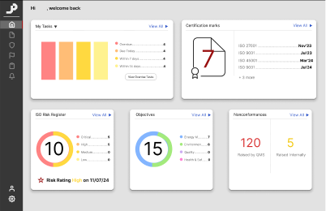
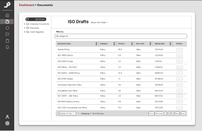
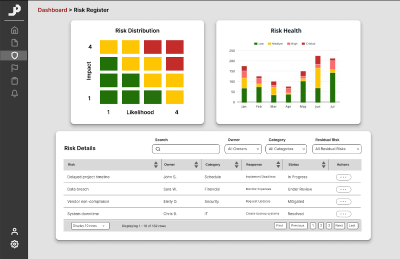
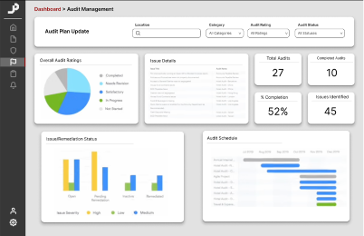
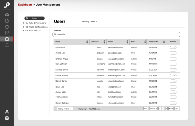
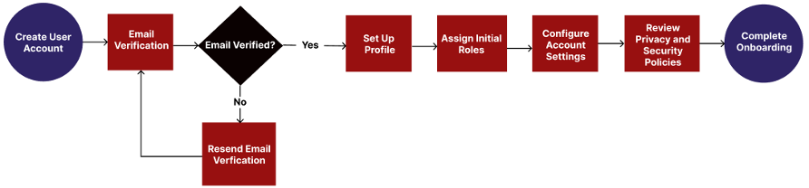
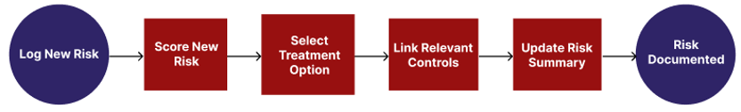
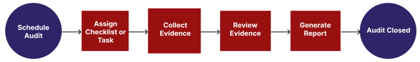
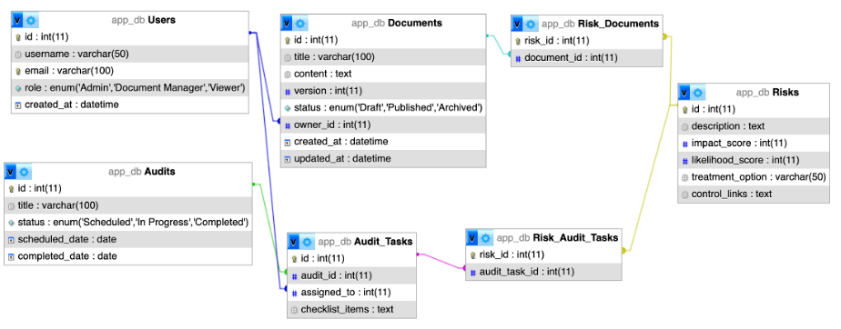

# Compliance Management Application Design Specification

## Project Documentation

### Table of Contents
- [Project Summary](#project-summary)
- [Project Objective](#project-objective)
- [Target Audience](#target-audience)
- [Key Differentiators](#key-differentiators)
- [Functional Requirements](#functional-requirements)
- [Non-Functional Requirements](#non-functional-requirements)
- [User Stories](#user-stories)
- [Wireframes](#wireframes)
- [User Flow Diagrams](#user-flow-diagrams)
- [Database Outline](#database-outline)
- [Database Schema](#database-schema)
- [Development Milestones](#development-milestones)

---

### Project Summary

This responsive web-based application is designed to help organisations streamline their security framework compliance processes. It facilitates document control, risk assessment, policy management, and audit tracking in an efficient, centralised, and user-friendly platform. By focusing on the core needs of security framework requirements, this app enables organisations to manage their governance, risk, and compliance (GRC) activities effectively, minimising manual processes and establishing consistent alignment with compliance standards.

---

### Project Objective

The application's primary objective is to simplify and centralise compliance management for organisations, ensuring seamless alignment with security frameworks such as ISO 27001.

---

### Target Audience

The application targets compliance officers, risk managers, IT and security teams, and other stakeholders in organisations that require adherence to security framework standards. It is designed for small to medium-sized enterprises as well as larger organisations with dedicated compliance or risk departments.

---

### Key Differentiators

- User-friendly interface with a visual compliance overview.
- Customisable workflows and reporting features.
- Comprehensive integration of document control, risk management, and audit processes.

---

### Functional Requirements

#### 1. Dashboard
- **1.1 Compliance Score**: Displays organisation’s compliance status.
- **1.2 Visual Insights**: Charts and graphs showing risks, audits, and document progress.
- **1.3 Deadline Notifications**: Alerts for tasks, document reviews, and deadlines.

#### 2. Document Management
- **2.1 Document Library**: Centralised repository for storing and categorising documents.
- **2.2 Version Control**: Automatic versioning with rollback options.
- **2.3 Approval Workflow**: Customisable document review and approval process.
- **2.4 Access Control**: Role-based permissions for secure document management.
- **2.5 Document Linking**: Links documents to controls, risks, and audits.

#### 3. Risk Management
- **3.1 Risk Dashboard**: Overview of risk levels and trends.
- **3.2 Risk Register**: Repository for identified risks.
- **3.3 Risk Assessment**: Tools for qualitative and quantitative risk assessments.
- **3.4 Risk Treatment**: Assign and track risk treatment plans.
- **3.5 Control Mapping**: Map risks to controls for effectiveness tracking.

#### 4. Policy and Control Management
- **4.1 Policy Repository**: Store and categorise policies with review cycles.
- **4.2 Control Mapping**: Map controls to framework requirements.
- **4.3 Control Effectiveness Evaluation**: Evaluate control performance.
- **4.4 Automated Reminders**: Notifications for policy reviews and updates.

#### 5. Audit Management
- **5.1 Audit Planning**: Define scope, objectives, and timelines.
- **5.2 Audit Checklist and Templates**: Customisable checklists for audits.
- **5.3 Evidence Collection**: Attach evidence to findings.
- **5.4 Audit Findings and Corrective Actions**: Log findings and track resolutions.
- **5.5 Automated Reporting**: Generate detailed audit reports.

#### 6. Compliance Reporting and Analytics
- **6.1 Compliance Score**: Real-time compliance metrics.
- **6.2 Customisable Reports**: Generate reports for specific areas.
- **6.3 Data Visualisation**: Charts and graphs for trends.
- **6.4 Export Options**: Export reports in PDF or CSV.

#### 7. User Management and Roles
- **7.1 Role-Based Access Control**: Define access levels for different roles.
- **7.2 User Management**: Add, remove, and update user accounts.
- **7.3 Multi-Factor Authentication (MFA)**: Enhanced security for accounts.

---

### Non-Functional Requirements

1. **Performance**: Modules load within 2 seconds.
2. **Scalability**: Supports over 1,000 concurrent users.
3. **Availability**: 99.9% uptime for consistent access.
4. **Security**: Prioritises data encryption, MFA, and audit logging.

---

### User Stories

1. As a Compliance Officer, I want to track ISO 27001 compliance in real-time to address gaps promptly.
2. As a Risk Manager, I want to assess risks to make informed decisions.
3. As an Auditor, I need structured checklists to align with ISO 27001.
4. As an Administrator, I want role-based access to secure data.

---

### Wireframes

1. **Dashboard Screen**  
   
2. **Document Management Screen**  
   
3. **Risk Register Screen**  
   
4. **Audit Management Screen**  
   
5. **User Management Screen**  
   

---

### User Flow Diagrams

1. **User Onboarding Flow**  
Steps include account setup, initial configuration, and assigning default roles.
   

2. **Document Approval Flow** 
Starting from document upload, users proceed to submit for review, followed by editing, approval, and final publication. 
   

3. **Risk Assessment Flow**  
Users log a new risk, assign scores, select treatment options (Mitigate, Accept, Transfer, Avoid), and link controls, concluding with an updated risk summary.
   

4. **Audit Process Flow**  
Includes audit scheduling, checklist assignment, evidence collection, and final report generation.
   

---

### Database Outline

#### Entities 
#### 1. Users
Entity for recording user accounts and roles
##### Attributes
- `id`
- `username`
- `email`
- `role`
- `created_at`

#### 2. Documents
Entity for recording document details such as titles, content, and versioning
##### Attributes
- `id`
- `title`
- `content`
- `version`
- `status`
- `owner_id`
- `created_at`
- `updated_at`

#### 3. Risks
Entity for recording logging and assessing risks with impact and likelihood scores
##### Attributes
- `id`
- `description`
- `impact_score`
- `likelihood_score`
- `treatment_option`
- `control_links`

#### 4. Audits
Entity for recording audit activities and statuses
##### Attributes
- `id`
- `title`
- `status`
- `scheduled_date`
- `completed_date`

#### 5. Audit Tasks
Entity for recording tasks associated with each audit
##### Attributes
- `id`
- `audit_id`
- `assigned_to`
- `status`

---

### Database Schema

